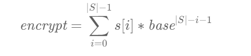

# 字符串哈希
将字符串转为哈希值,例如给定字符串 s=abca，其包含的字符种类为 3（即 abc 三种）。我们取 base=9，将字符串 s 看成九进制数 (0120)，转换为十进制为 99，也就是说字符串 abca 的编码为 99。一般地，计算编码值的公式如下：



- 链接：https://leetcode.cn/problems/longest-happy-prefix/solutions/172436/zui-chang-kuai-le-qian-zhui-by-leetcode-solution/

```cpp
int base = 31, mod = 1000000007;
int prefix = 0;
for (int i = 1; i < n; ++i) {
    prefix = ((long long)prefix * base + (s[i - 1] - 97)) % mod;
}

```