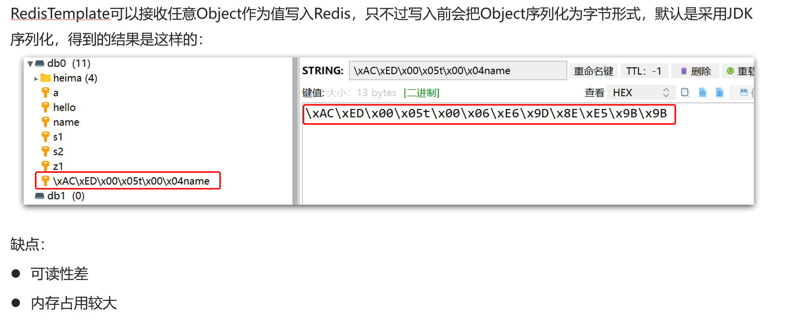

# SpringDataRedis  

!!! warning "简介"
    SpringData是Spring中数据操作的模块，包含对各种数据库的集成，其中对Redis的集成模块就叫做**_SpringDataRedis_**。

???+ example "功能"
    - 提供了对不同Redis客户端的整合（Lettuce和Jedis）
    - 提供了RedisTemplate统一API来操作Redis
    - 支持Redis的发布订阅模型
    - 支持Redis哨兵和Redis集群
    - 支持基于Lettuce的响应式编程
    - 支持基于JDK、JSON、字符串、Spring对象的数据序列化及反序列化
    - 支持基于Redis的JDKCollection实现

## 不同数据类型的操作API  

  

## SpringBoot

### 1.引入依赖

```xml
<!--Redis依赖-->
<dependency>
    <groupId>org.springframework.boot</groupId>
    <artifactId>spring-boot-starter-data-redis</artifactId>
</dependency>
<!--连接池依赖-->
<dependency>
    <groupId>org.apache.commons</groupId>
    <artifactId>commons-pool2</artifactId>
</dependency>
```

### 2.配置文件

```yaml
# application.properties文件里
spring:
    redis:
        host:172.18.84.81
        port: 6379
        lettuce:
            pool:
                max-active: 8 #最大连接
                max-idle: 8 #最大空闲连接
                min-idle: 8 #最小空闲连接
                max-wait: 100 #连接等待时间
```

### 3.注入RedisTemplate

```java
@Autowired
private RedisTemplate redisTemplate;
```

### 4.测试

```java
@SpringBootTest
public class RedisTest {
    @Autowired
    private RedisTemplate redisTemplate;
    @Test
    void testString(){
        redisTemplate.opsForValue().set("name","fmy1");
        Object name = redisTemplate.opsForValue().get("name");
        System.out.println("name = " + name);
    }
    //进行序列化配置后，会实现自动序列化、反序列化
    @Test
    void testSaveUser(){
        redisTemplate.opsForValue().set("user:100",new User("fmy",21));
        User p = (User) redisTemplate.opsForValue().get("user:100");
        System.out.println(p);
    }
}
```

## SpringDataRedis的序列化方式

### 序列化问题



### 序列化配置

```java
@Configuration
public class RedisConfig {
    @Bean
    public RedisTemplate<String,Object> redisTemplate(RedisConnectionFactory connectionFactory) throws UnknownHostException {
        //创建RedisTemplate 对象
        RedisTemplate<String, Object> template = new RedisTemplate<>();
        template.setConnectionFactory(connectionFactory);
        //创建JSON序列化工具
        GenericJackson2JsonRedisSerializer jackson2JsonRedisSerializer = new GenericJackson2JsonRedisSerializer();
        // 设置Key的序列化
        template.setKeySerializer(RedisSerializer.string());
        template.setHashKeySerializer(RedisSerializer.string());
        //设置Value的序列化
        template.setValueSerializer(jackson2JsonRedisSerializer);
        template.setHashValueSerializer(jackson2JsonRedisSerializer);
        //返回
        return template;


    }
}
```

### JSON的序列化方式的问题

        为了在反序列化时知道对象的类型，JSON序列化器会将类的class类型写入json结果中，存入Redis，
    会带来额外的内存开销。  
        为了节省内存空间，我们并不会使用JSON序列化器来处理value，而是统一使用String序列化器，要求
    只能存储String类型的key和value。当需要存储Java对象时，手动完成对象的序列化和反序列化。

### StringRedisTemplate
```java
@SpringBootTest
public class RedisStringTest {
    @Autowired
    private StringRedisTemplate stringRedisTemplate;
    @Test
    void testString(){
        stringRedisTemplate.opsForValue().set("name","wzq");
        Object name = stringRedisTemplate.opsForValue().get("name");
        System.out.println("name = " + name);

    }
    private static final ObjectMapper mapper = new ObjectMapper();
    @Test
    void testSaveUser() throws JsonProcessingException {
        // 创建对象
        User user  = new User("fmy" , 21);
        // 手动序列化
        String json = mapper.writeValueAsString(user);
        // 写入数据
        stringRedisTemplate.opsForValue().set("user:200",json);

        //获取数据
        String jsonUser = stringRedisTemplate.opsForValue().get("user:200");
        //手动反序列化
        User user1 = mapper.readValue(jsonUser,User.class);
        System.out.println("user1 = " + user1);

    }
}

```

## 总结
