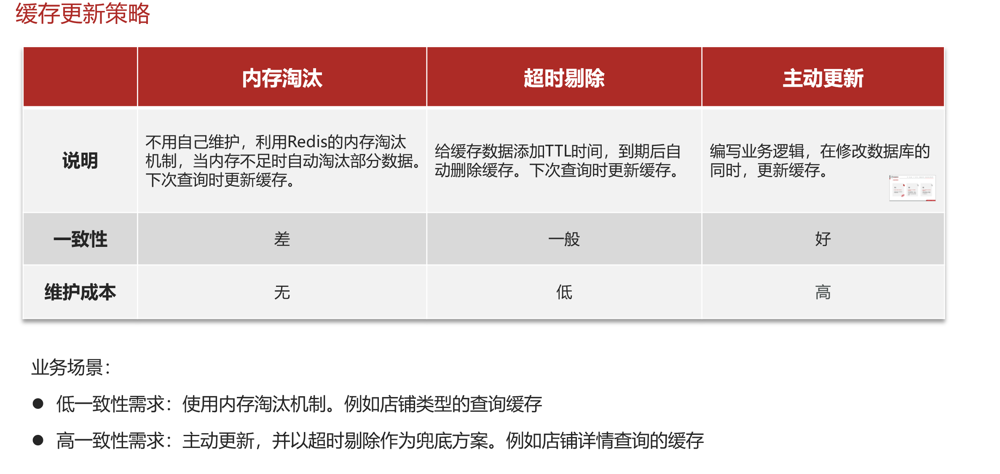
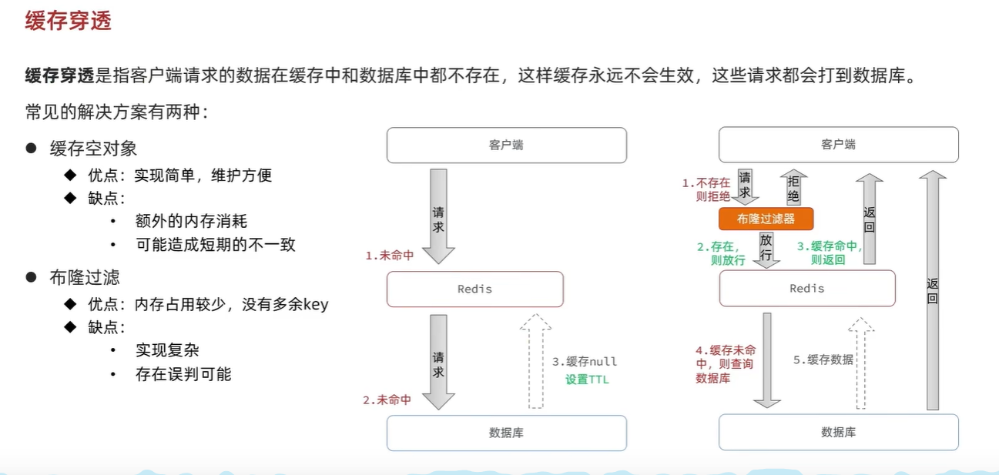

# redis缓存

## 缓存更新策略

## 缓存穿透

!!! note "缓存穿透产生的原因"
    用户请求的数据在缓存中和数据库中都不存在，不断发起这样的请求，给数据库带来巨大压力
   

???+ example "缓存穿透的解决方案"
    - 缓存null值
    - 布隆过滤
    - 增强id的复杂度，避免被猜测id规律
    - 做好数据的基础格式校验
    - 加强用户权限校验
    - 做好热点参数的限流

## 缓存雪崩
**缓存雪崩**指在同一时段**_大量的缓存key同时失效_**或者**_Redis服务宕机_**，导致大量请求到达数据库，带来巨大压力。

???+ example "缓存雪崩的解决方案"
    - 给不同的Key的TTL添加随机值
    - 利用Redis集群提高服务的可用性
    - 给缓存业务添加降级限流策略
    - 给业务添加多级缓存

## 缓存击穿

### 互斥锁与逻辑过期
