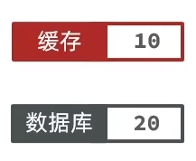
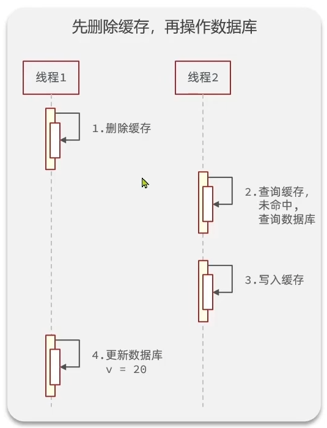

# 操作数据库和缓存需要考虑的三个问题

## 1. 删除缓存还是更新缓存?

- 更新缓存： 每次更新数据库都要更新缓存，无效写操作较多  **×**
- 删除缓存：更新数据库时让缓存失效，查询时更新缓存。写多读少就不用缓存了。 **√**

## 2. 如何保证缓存与数据库的操作的同时成功或失败？

- 单体系统， 将缓存与数据库操作放在一个事务
- 分布式系统，利用TCC等分布式事务方案

## 3. 先操作缓存还是先操作数据库

- 先删除缓存，再操作数据库

- 先操作数据库，再删除缓存

由于对**缓存操作的速度远大于对数据库操作**，所以这种情况*发生的概率较小*，所以这种方案更优秀

## 总结
!!! info "最佳实践方案"
    1. 低一致性需求: 使用redis自带的内存淘汰机制
    2. 高一致性需求：主动更新，并以超时剔除作为兜底方案
        - 读操作：
            - 缓存命中则直接返回
            - 缓存未命中则查询数据库，并写入缓存，设定超时时间
        - 写操作：
            - 先写数据库，然后再剔除缓存
            - 要确保数据库与缓存操作的原子性

