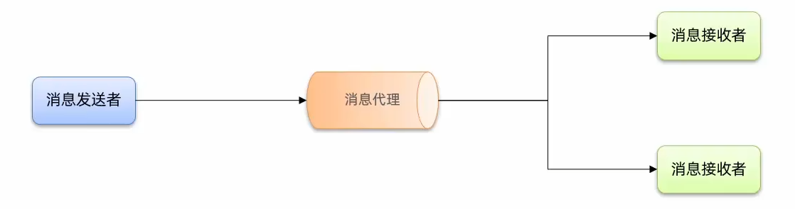
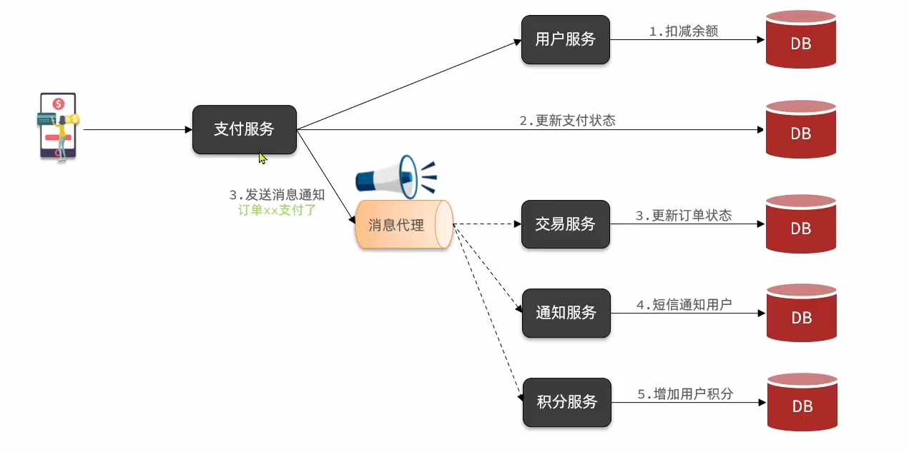
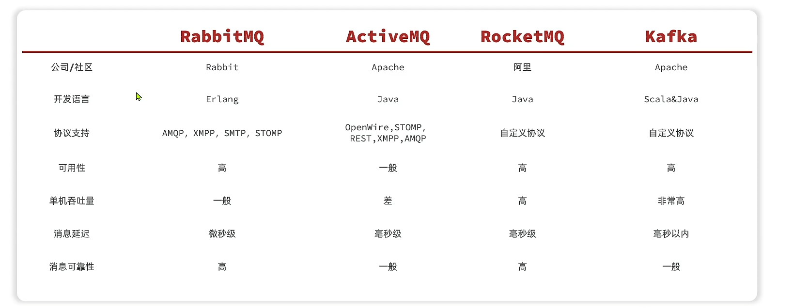
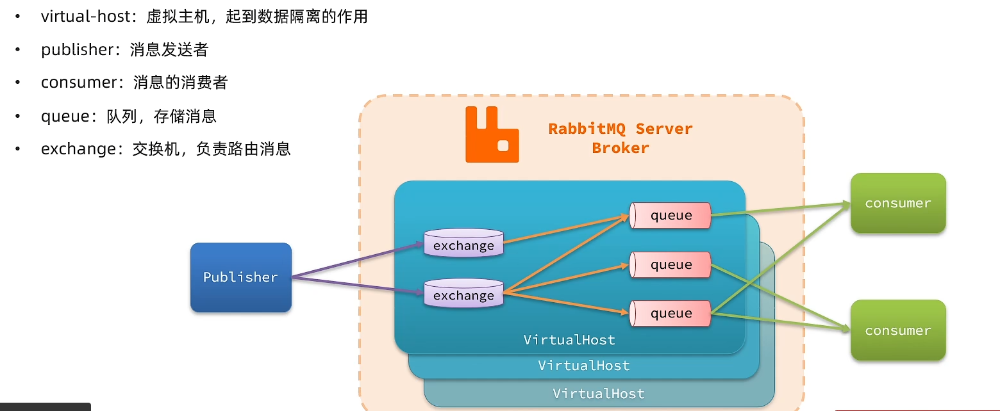

# MQ基础


## **同步调用**和**异步调用**

同步调用： 等待到结果才返回


异步调用：不用等待下游结果



## 订单服务中的同步和异步调用



## MQ技术选型

ps:阿里的开源软件bug有点多，基本上是冲业绩升级才开源，更新缓慢，RabbitMQ用的比较多。


## RabbitMQ运行

```bash
docker run  -e RABBITMQ_DEFAULT_USER=itheima  
            -e RABBITMQ_DEFAULT_PASS=123321  
            -v mq-plugins:/plugins  
            --name mq  
            --hostname mq  
            -p 15672:15672   # 将容器内的 15672 端口映射到主机的 15672 端口
            -p 5672:5672  
            --network hm-net 
            -d  
            rabbitmq:3.13-management
```
访问主机localhost:15672,输入用户名和密码。

- `docker run`：启动一个 Docker 容器。

- `-e RABBITMQ_DEFAULT_USER=itheima`：设置 RabbitMQ 的默认用户名为 `itheima`。

- `-e RABBITMQ_DEFAULT_PASS=123321`：设置 RabbitMQ 的默认密码为 `123321`。

- `-v mq-plugins:/plugins`：挂载一个名为 `mq-plugins` 的卷到容器内的 `/plugins` 目录，用于持久化插件配置。

- `--name mq`：给容器命名为 `mq`。

- `--hostname mq`：设置容器的主机名为 `mq`。

- `-p 15672:15672`：将容器的 `15672` 端口映射到主机的 `15672` 端口（用于访问 RabbitMQ 的管理控制台）。

- `-p 5672:5672`：将容器的 `5672` 端口映射到主机的 `5672` 端口（RabbitMQ 的默认通信端口）。

- `--network hm-net`：将容器连接到名为 `hm-net` 的 Docker 网络。

- `-d`：让容器在后台运行。

- `rabbitmq:3.13-management`：使用 `rabbitmq` 镜像，版本是 `3.13-management`，这个版本包含了 RabbitMQ 的管理插件。


## RabbitMQ整体架构和核心概念


