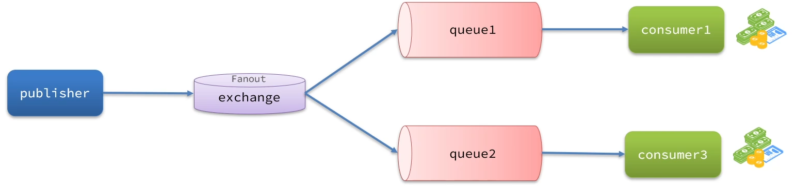
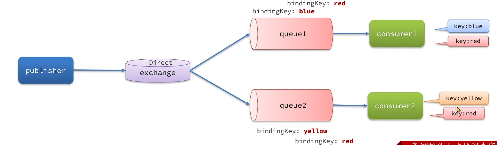
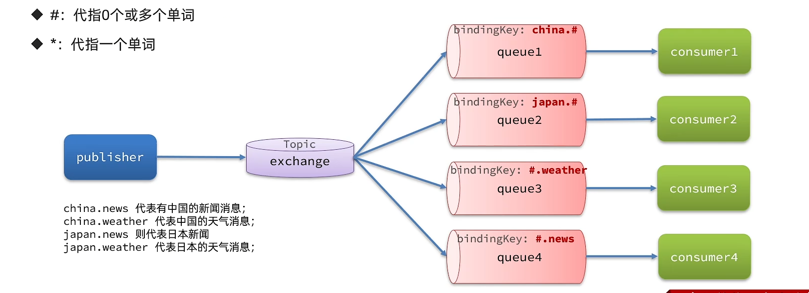

# 交换机
## 为什么需要交换机？
- 生产者只需要将消息发送到交换机，无需关心具体哪个队列会接收该消息；而消费者从队列中获取消息，实现了生产者与消费者的松耦合

- 交换机可以根据预设的路由规则（如直连、扇出、主题、头交换机等）将消息投递到一个或多个队列

- 通过交换机进行消息分发，可以轻松添加、修改或删除队列及其绑定规则，而不影响消息的产生者

总结： 交换机通过根据预设规则将消息路由到相应队列，实现了生产者与消费者之间的解耦和灵活扩展。

## Fanout交换机：广播
Fanout Exchange会将接收到的消息广播到每一个跟其绑定的queue,所以也叫广播模式。

## Direct交换机：定向
Direct Exchange 会将收到的消息根据规则路由到指定的Queue，因此称为定向路由。

-  每个Queue都与Exchange设置一个BindingKey
-  发布者发送消息时，指定消息的RoutingKey
-  Exchange将消息路由到BindingKey与消息RoutingKey一致的队列

## Topic交换机：话题

TopicExchange与DirectExchange类似，区别在于routingKey可以是多个单词的列表，并且以 **\.** 分割。

Queue与Exchange指定BindingKey时可以使用通配符：
-

